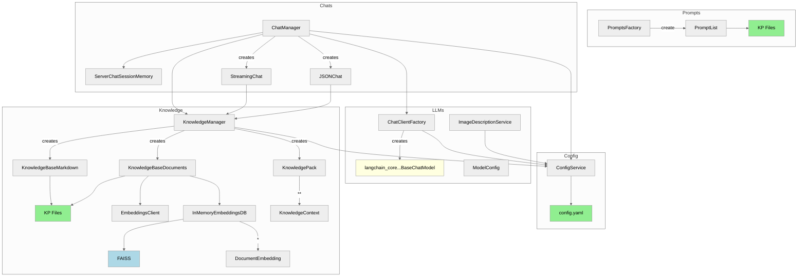
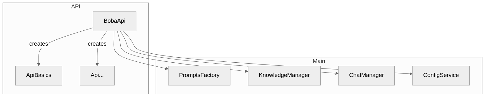

# Codebase overview

This is a high level overview of how the (Python) code is structured, as of the time of committing this. It's not fully complete, but shows the components that are most important to understand the structure. 

First, an overview of the main shared components

* "KP Files" stands for "Knowledge Pack Files", i.e. that component is loading files from the knowledge pack
* All of these are getting wired together in [`App`](../app/app.py).

---

## Component Design

Haiven is structured around four main concerns, each handled by a distinct group of components:

1. **Configuration** — reads provider settings and model definitions from `config.yaml` and `.env`
2. **LLM Clients** — creates and manages connections to LLM providers (OpenAI, Azure, Bedrock, Google, Anthropic, Ollama) via a factory pattern
3. **Knowledge** — loads and indexes knowledge packs from disk, providing markdown contexts and FAISS-backed document embeddings
4. **Chats** — manages per-user chat sessions, routing requests to the appropriate chat type (`StreamingChat` or `JSONChat`)

These components are wired together in `app.py` and exposed to the React frontend through a FastAPI layer.

---

## Python Components

### Configuration

`ConfigService` reads `config.yaml` and environment variables, providing model configurations and provider settings to other components. It is injected into most other services.

### LLM Layer

`ChatClientFactory` produces `ChatClient` instances for each supported LLM provider. It uses `ModelConfig` (from `ConfigService`) to select the correct provider backend. `ImageDescriptionService` wraps vision-capable models for image input.

### Knowledge Layer

`KnowledgeManager` loads and caches the active knowledge pack. It exposes:
- `KnowledgeBaseMarkdown` — loads markdown files from the knowledge pack directory and aggregates them as system context
- `KnowledgeBaseDocuments` — loads document embeddings using `EmbeddingsClient` and stores them in an in-memory FAISS index (`InMemoryEmbeddingsDB`) for similarity search
- `KnowledgePack` / `KnowledgeContext` — metadata and structured context about the loaded pack

### Chat Layer

`ChatManager` creates and retrieves user chat sessions stored in `ServerChatSessionMemory`. Two chat types are supported:

- `StreamingChat` (`HaivenBaseChat` subclass) — streams LLM responses token by token using SSE; supports optional document context via similarity search
- `JSONChat` (`HaivenBaseChat` subclass) — returns structured JSON-formatted events; used for features that need to parse model output

`HaivenBaseChat` provides shared behaviour: system prompt construction from knowledge context, conversation memory, and similarity-based document retrieval.

### API Layer

`BobaApi` (in `app/app.py`) wires together the above components and registers FastAPI route handlers. Individual feature domains (chat, research, creative, key management) each have their own handler files under `app/api/`.

### Diagram: Main Python Components

We currently have one consumer of those main components, which is the API used by the React frontend.

---

## React Components

The frontend is a Next.js application (client-only, no SSR) in `ui/src/`. Components follow the `_component_name.js` naming convention. Styling uses Tailwind CSS and Ant Design.

### Pages and Entry Points

Top-level page files (`index.js`, `chat.js`, `cards.js`, `knowledge-chat.js`, `scenarios.js`, etc.) define the routes. They are composed from reusable components in `ui/src/app/`.

### Core Components

| Component | Purpose |
|-----------|---------|
| `_layout.js` | App shell: header, sidebar, disclaimer popup |
| `_header.js` | Top navigation bar |
| `_sidebar.js` | Left-side navigation menu |
| `_navigation_items.js` | Navigation link definitions |
| `_chat.js` | Core multi-turn chat UI with SSE streaming |
| `_prompt_chat.js` | Prompt-driven chat with template selection |
| `_cards-list.js` | Grid display of prompt cards |
| `_cards-chat.js` | Chat interface launched from a card |
| `_context_choice.js` | Knowledge context selector panel |
| `_add_context.js` | UI for injecting additional context into a chat |
| `_markdown_renderer.js` | Renders markdown output from the LLM |
| `_mermaid_diagram.js` | Renders Mermaid diagrams within chat output |
| `_boba_api.js` | Thin client layer for all backend API calls |
| `_fetch_sse.js` | SSE stream handler for streaming chat responses |

### API Communication

`_boba_api.js` centralises all calls to the FastAPI backend. Streaming chat uses `_fetch_sse.js` to consume server-sent events and deliver tokens to the UI incrementally.

### State and Hooks

Custom hooks in `ui/src/app/` (e.g., `useLoader.js`) manage async loading state. Local UI state is handled in individual components; there is no global state library.
